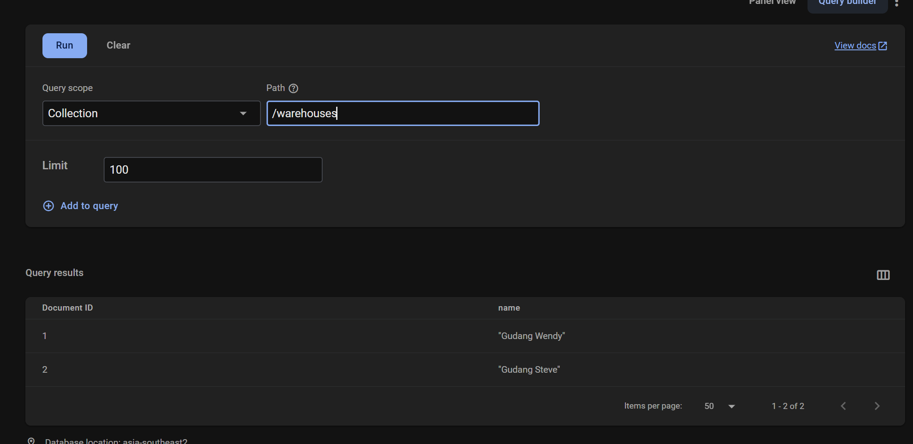

# Selamat datang di UTS PALP Genap 2025

> Silakan download Google Service JSON di
> <https://bit.ly/2025Apr_google_service_json>

Struktur Database di Firestore adalah sebagai berikut:

> #### Tabel Products
>
> Tabel ini berupa 2 field dengan struktur ID dan name seperti pada gambar berikut:
> 

> #### Tabel Stores
>
> Tabel ini digunakan untuk menyimpan store dan sudah ada 7 data yang berisi store dari masing-masing mahasiswa:
> 

> #### Tabel Suppliers
>
> Tabel ini berupa ID dan nama dari supplier
> 

> #### Tabel Warehouses
>
> Tabel ini berupa ID dan nama dari warehouse
> 

> #### Tabel PurchaseGoodsReceipts
>
> Tabel ini berisi header yang menyimpan transaksi penerimaan barang dan tabel ini yang akan Anda gunakan untuk mengerjakan UTS Anda.
> **Perhatikan! Ada 9 field yang harus Anda buat CRUD-nya** > 
> Barang-barang yang akan diterima dibuat dalam tabel detil seperti pada gambar berikut:
> 
> tabel detil ini memuat 2 baris data/item dengan 5 field yaitu price, product_ref, qty, subtotal, dan unit_name.Tabel ini juga harus Anda buat CRUD-nya berkaitan dengan tabel header.
